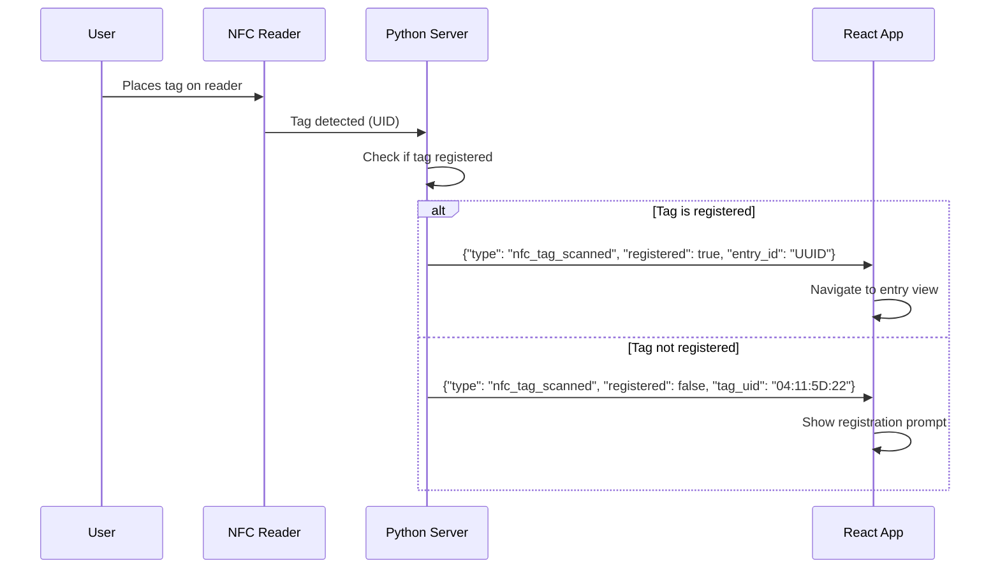
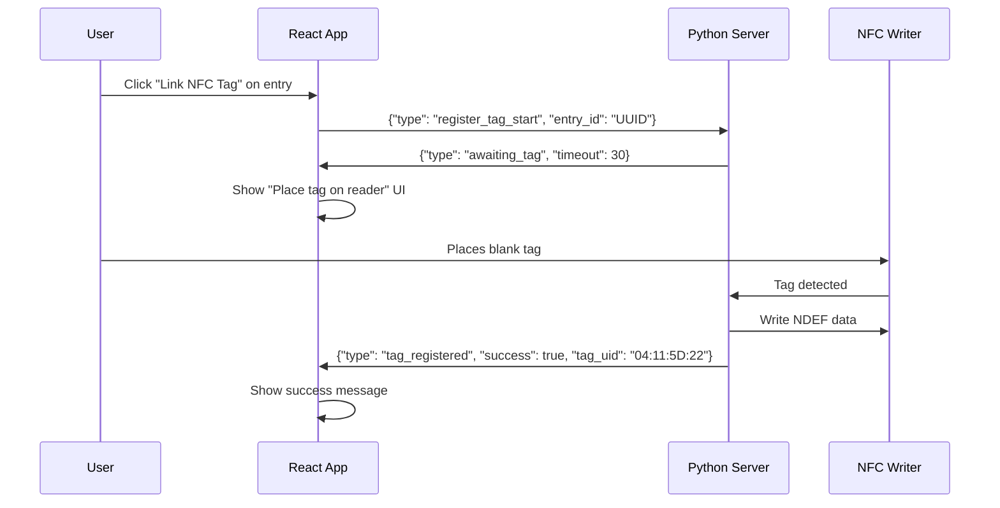
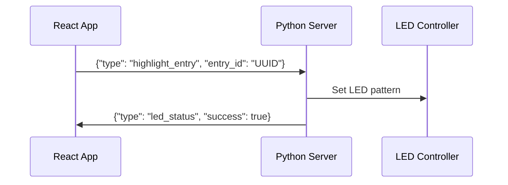

# WebSocket Architecture for NFC & LED Communication

## Overview

This document outlines the planned WebSocket infrastructure for bidirectional communication between Python services (NFC reader, LED controller) and the React web application.

## Architecture Components

```
┌─────────────────┐     WebSocket      ┌──────────────────┐
│   React App     │◄──────────────────►│  Python Server   │
│                 │                     │                  │
│  - Dashboard    │                     │  - WebSocket Hub │
│  - Entry View   │                     │  - NFC Service   │
│  - NFC UI       │                     │  - LED Service   │
└─────────────────┘                     └──────────────────┘
                                               │     │
                                               │     │
                                        ┌──────┴─┐ ┌─┴──────┐
                                        │ PN532  │ │WS2812B │
                                        │  NFC   │ │  LEDs  │
                                        └────────┘ └────────┘
```

## Communication Flows

### 1. NFC Tag Scanning Flow



### 2. NFC Tag Registration Flow



### 3. LED Control Flow (Future)



## Message Protocol

### WebSocket Message Format

All messages follow a consistent JSON structure:

```json
{
  "type": "message_type",
  "timestamp": "2024-01-15T10:30:00Z",
  "data": {
    // Message-specific payload
  }
}
```

### Message Types

#### Client → Server Messages

1. **Connection Init**
```json
{
  "type": "client_init",
  "data": {
    "client_id": "react-app-001",
    "capabilities": ["nfc_read", "nfc_write", "led_control"]
  }
}
```

2. **Register Tag Start**
```json
{
  "type": "register_tag_start",
  "data": {
    "entry_id": "1A88256FB33855EEB831ED2569B135CF",
    "timeout": 30
  }
}
```

3. **Cancel Tag Registration**
```json
{
  "type": "register_tag_cancel",
  "data": {}
}
```

4. **Highlight Entry (LED)**
```json
{
  "type": "highlight_entry",
  "data": {
    "entry_id": "1A88256FB33855EEB831ED2569B135CF",
    "duration": 5000,
    "pattern": "pulse"
  }
}
```

5. **Highlight Type (LED)**
```json
{
  "type": "highlight_type",
  "data": {
    "type": "Beach",
    "duration": 10000,
    "color": "#E6C200"
  }
}
```

#### Server → Client Messages

1. **NFC Tag Scanned (Registered)**
```json
{
  "type": "nfc_tag_scanned",
  "data": {
    "registered": true,
    "tag_uid": "04:11:5D:22:2C:65:80",
    "entry_id": "1A88256FB33855EEB831ED2569B135CF",
    "entry_data": {
      "title": "Bondi Beach Morning",
      "location": "Bondi Beach, Sydney",
      "date": "2024-01-15"
    }
  }
}
```

2. **NFC Tag Scanned (Unregistered)**
```json
{
  "type": "nfc_tag_scanned",
  "data": {
    "registered": false,
    "tag_uid": "04:11:5D:22:2C:65:80"
  }
}
```

3. **Awaiting Tag**
```json
{
  "type": "awaiting_tag",
  "data": {
    "message": "Place NFC tag on reader",
    "timeout_remaining": 25
  }
}
```

4. **Tag Write Progress**
```json
{
  "type": "tag_write_progress",
  "data": {
    "progress": 75,
    "message": "Writing NDEF data..."
  }
}
```

5. **Tag Registered**
```json
{
  "type": "tag_registered",
  "data": {
    "success": true,
    "tag_uid": "04:11:5D:22:2C:65:80",
    "entry_id": "1A88256FB33855EEB831ED2569B135CF",
    "ndef_data": {
      "entry_id": "1A88256FB33855EEB831ED2569B135CF",
      "coordinates": {
        "lat": -33.890542,
        "lng": 151.274856
      },
      "timestamp": "2024-01-15T08:30:00Z"
    }
  }
}
```

6. **Error Messages**
```json
{
  "type": "error",
  "data": {
    "error_code": "NFC_WRITE_FAILED",
    "message": "Failed to write to NFC tag",
    "details": "Tag may be write-protected or damaged"
  }
}
```

## NFC Tag Data Structure

### NDEF Payload Format

The NFC tag will contain a single NDEF record with JSON data:

```json
{
  "v": 1,                                    // Version
  "id": "1A88256FB33855EEB831ED2569B135CF", // Entry UUID
  "geo": [-33.890542, 151.274856],          // [lat, lng]
  "ts": 1705315800,                          // Unix timestamp
  "t": "Beach"                               // Type (optional, for LED mapping)
}
```

This compact format ensures we stay within NTAG213's 144-byte limit while including all essential data.

## Python Server Architecture

### Component Structure

```
python-services/
├── server.py              # Main WebSocket server
├── services/
│   ├── __init__.py
│   ├── nfc_service.py     # NFC reader/writer service
│   └── led_service.py     # LED controller service
├── handlers/
│   ├── __init__.py
│   ├── nfc_handler.py     # NFC message handlers
│   └── led_handler.py     # LED message handlers
├── models/
│   ├── __init__.py
│   └── messages.py        # Message type definitions
└── utils/
    ├── __init__.py
    ├── journal.py         # Journal data access
    └── logger.py          # Logging utilities
```

### Key Design Decisions

1. **Single WebSocket Server**: One Python process manages all hardware services
2. **Service Isolation**: NFC and LED services run in separate threads
3. **Message Queue**: Internal queue for thread-safe communication
4. **JSON Journal Integration**: Direct read/write to journal.json
5. **Graceful Degradation**: Services continue if hardware unavailable

## React Integration

### WebSocket Hook

```javascript
// hooks/useWebSocket.js
const useWebSocket = () => {
  const [connected, setConnected] = useState(false);
  const [lastMessage, setLastMessage] = useState(null);
  
  // Connection management
  // Message handling
  // Reconnection logic
  
  return { connected, sendMessage, lastMessage };
};
```

### NFC Context

```javascript
// context/NFCContext.js
const NFCContext = createContext({
  isScanning: false,
  isRegistering: false,
  lastScannedTag: null,
  registerTag: (entryId) => {},
  cancelRegistration: () => {}
});
```

## Implementation Phases

### Phase 1: Core Infrastructure
- [ ] Python WebSocket server setup
- [ ] Basic message protocol
- [ ] React WebSocket client
- [ ] Connection management

### Phase 2: NFC Integration
- [ ] NFC scanning service
- [ ] Tag registration flow
- [ ] Journal.json integration
- [ ] Error handling

### Phase 3: UI Polish
- [ ] Registration progress UI
- [ ] Error states
- [ ] Success animations
- [ ] Timeout handling

### Phase 4: LED Control (Future)
- [ ] LED service implementation
- [ ] Grid mapping
- [ ] Animation patterns
- [ ] Type highlighting

## Security Considerations

1. **Local Network Only**: WebSocket server binds to localhost
2. **No Authentication**: Assumed trusted local environment
3. **Input Validation**: Sanitize all message data
4. **Rate Limiting**: Prevent NFC scanning spam

## Error Handling

### Connection Errors
- Automatic reconnection with exponential backoff
- Offline mode for React app
- Queue messages during disconnection

### Hardware Errors
- Graceful degradation if NFC/LED unavailable
- Clear error messages to user
- Retry mechanisms for transient failures

### Data Errors
- Validate journal entries before writing
- Handle malformed NFC tags
- Prevent duplicate registrations

## Testing Strategy

1. **Mock Hardware Mode**: Simulate NFC/LED for development
2. **Message Replay**: Record and replay WebSocket sessions
3. **Integration Tests**: Full flow testing
4. **Error Injection**: Test failure scenarios

## Performance Considerations

- Message throttling for LED updates
- Efficient JSON parsing
- Minimal tag data for fast NFC writes
- WebSocket compression for larger messages

## Future Extensions

1. **Batch Operations**: Register multiple tags
2. **Tag Management**: List, update, delete registrations
3. **LED Patterns**: Custom animations per entry type
4. **Mobile Support**: Web NFC API integration
5. **Multi-Client**: Support multiple dashboard instances